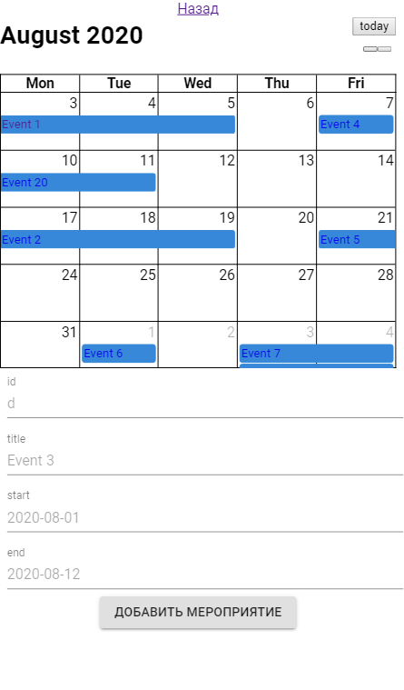

# SoundColor
- ✔️ реализовать список студентов (импорт/экспорт из firebase), добавление, редактирование, удаление
	- реализовать систему фильтров
	- ✔️ настройка цвета карточки студента в зависимости от уровня 
	- ✔️ реализовать страницу студента
	- отображение количества пропусков, количество посещенных практик и т.д
- ✔️ реализовать календарь 
	- ✔️ реализовать импорт/экспорт мероприятий для календаря
	- редактирование, удаление мероприятий для календаря
	- ✔️ создать страницу мероприятия 
		- (время начала, время окончания, дата, отвественный, список людей и их оборудование)
		- реализовать механизм записи людей	на мероприятие
		- создать механику ответственного за мероприятие 
			- один из людей записаных на мероприятие может взять на себя "отвественность" (увеличивается уровень пользователя)
			- если никто не взял на себя "отвественность", алгоритм выбирает псевдо-случайного человека
			- реализовать выбор оборудования для мероприятия
- реализовать авторизацию (google) и проверку валидности пользователя 
- реализовать вход 
	- если человек не зарегистрирован/не вошел в систему не отображать информацию (редирект на вход) 
	

